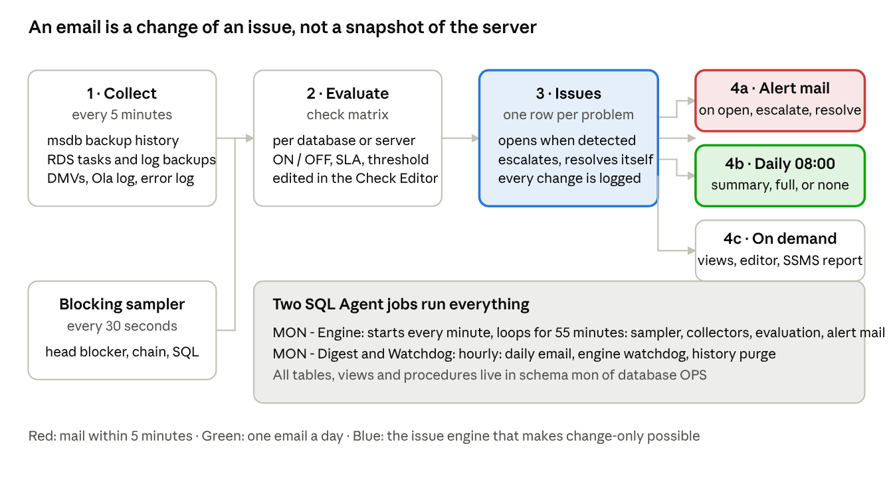
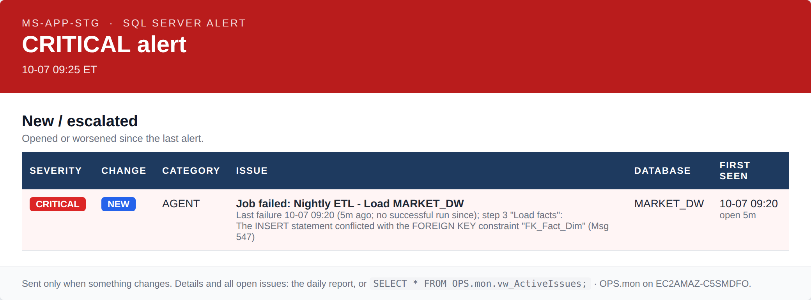
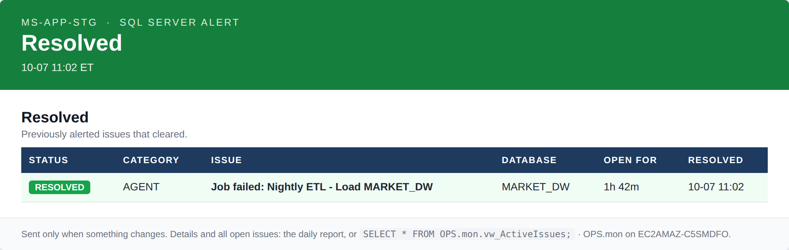
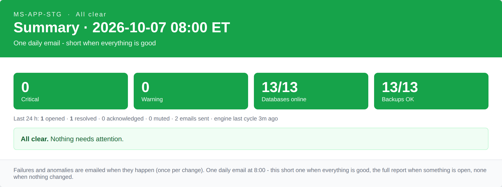
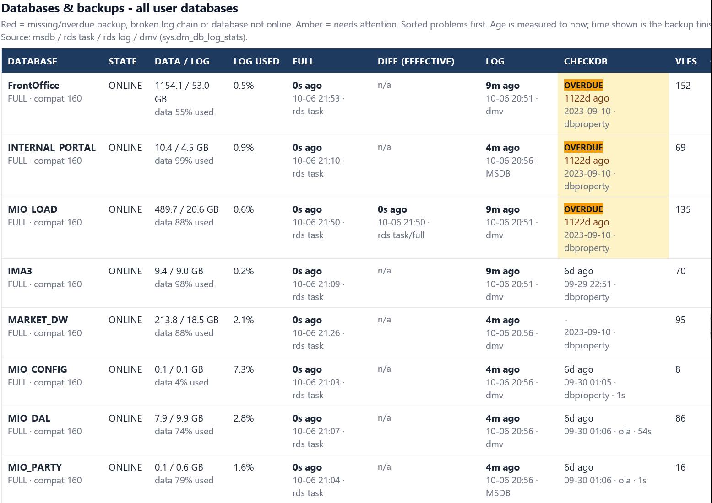
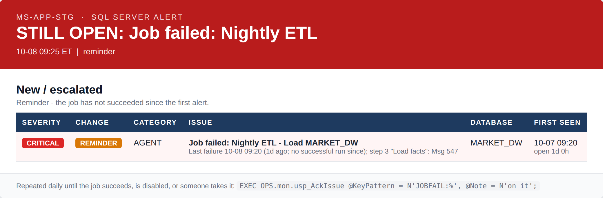
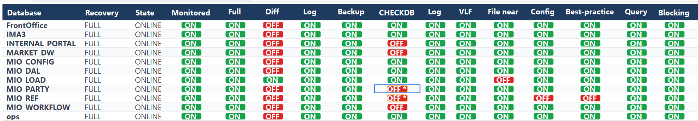

# OPS.mon — SQL Server Monitoring: Overview for Management

MS-APP-STG (Amazon RDS for SQL Server) · rev 5.7 · October 2026 · Alexey, DBA

OPS.mon watches the MS-APP-STG SQL Server and sends email only when something changed: a brief alert within 5 minutes of a failure, a notice when it is fixed, and one email a day. Everything runs inside schema mon of the OPS database. Source, installer and tools: github.com/alexhdsale/code-for-sql-server/tree/main/ops-mon.

## Summary

OPS.mon is installed on MS-APP-STG and runs next to the legacy OPS.monitor rev 4. **Decision requested:** approve the production rollout and a retirement date for the rev 4 jobs.

| **Question a manager asks** | **Answer**                                                                                                                                                       |
|-----------------------------|------------------------------------------------------------------------------------------------------------------------------------------------------------------|
| How often will I get email? | A quiet week: one short summary a day, or none when nothing changed. An incident: one alert when it opens, one notice when it is fixed.                          |
| Will a failure be missed?   | No. A failed SQL Agent job is mailed when it fails and again every day until it succeeds, is disabled, or a DBA acknowledges it.                                 |
| What does it watch?         | Backups, integrity (CHECKDB), Agent jobs, blocking and performance, capacity, configuration drift, server events, and its own health.                            |
| What does it touch?         | Only schema mon in database OPS plus two Agent jobs. No application database is changed.                                                                         |
| How is it deployed?         | One installer file, idempotent, with a self-test gate; a one-step uninstall; source and docs on GitHub.                                                          |
| What has it found so far?   | Three databases with no clean DBCC CHECKDB since 2023, a broken log-backup chain on one database, and a DIFF-backup SLA that did not match the nightly schedule. |

## What is monitored

Every check can be switched on or off per database or per server, with its own SLA or threshold.

| **Area**       | **Checks**                                                                                                                                                             | **Typical issue raised**                               |
|----------------|------------------------------------------------------------------------------------------------------------------------------------------------------------------------|--------------------------------------------------------|
| Backups        | FULL / DIFF / LOG age against SLA, broken log chain, retention depth, files made vs files still on storage, storage lifecycle policy                                   | FULL backup overdue 26 h; LOG chain broken on ops      |
| Integrity      | Last good DBCC CHECKDB from three sources (DATABASEPROPERTYEX, DBCC DBINFO, Ola CommandLog); corruption found by Ola jobs                                              | No clean CHECKDB for 1,122 days on FrontOffice         |
| SQL Agent jobs | Failed or cancelled jobs until they succeed; maintenance jobs over their SLA; jobs running far longer than their 30-day median                                         | Job failed: \_test_job (step 1); IndexOptimize OVERDUE |
| Performance    | Blocking over 10 minutes with the full chain (head blocker, open-transaction age, SQL text), deadlocks, long queries, open transactions, CPU, page life, memory grants | Blocking 14 min, head session 83 (app_user)            |
| Capacity       | Storage free space, log used %, files near MAXSIZE, VLF count, tempdb and version store                                                                                | Log 92% used on MARKET_DW                              |
| Configuration  | Database option drift against a baseline, best-practice settings, Query Store state                                                                                    | AUTO_CLOSE turned on for MIO_REF                       |
| Server events  | RDS error log, failed logins, Database Mail failures, RDS backup and restore tasks                                                                                     | RDS task 6082 BACKUP_DB ERROR                          |
| Itself         | Engine heartbeat (watchdog), release self-test, email statistics, data retention per area                                                                              | MON - Engine has not run for 15 min                    |

## How it works



*Data workflow: collect, evaluate, issues, three outputs*

Collectors read the server; the check matrix decides what counts; the issue engine keeps one row per problem; three outputs. An email is sent when an issue changes state, never because the clock ticked. Two SQL Agent jobs run everything: MON - Engine (every minute, loops 55 minutes) and MON - Digest & Watchdog (hourly).

## Emails

Three situations, three answers. All of it is settings in mon.Setting (hours, weekdays, severity threshold, recipients, brief or full style, reminder interval).

| **Situation**       | **What arrives**                                                                                                                                                    | **When**                                     |
|---------------------|---------------------------------------------------------------------------------------------------------------------------------------------------------------------|----------------------------------------------|
| Something broke     | A brief alert with only the failure (alert_style = BRIEF); a RESOLVED notice when it clears                                                                         | Within 5 minutes; once per change            |
| A job keeps failing | The same alert again, marked REMINDER, subject STILL OPEN                                                                                                           | Daily, until fixed, disabled or acknowledged |
| Every day at 08:00  | Short summary when all is good; the full report when anything is open; **no email** when nothing changed since yesterday (Monday always sends one as proof of life) | 08:00 local, every day                       |

### Brief alert

Subject names the problem; the body is one row: severity, what changed, the failed step and the SQL error, database, how long it has been open. No list of other active issues, no counters.



*Sample brief alert (production template, sample data)*

### Resolved

Sent once the condition clears, so the loop is closed in the inbox.



*Sample resolved notice*

### Daily summary on a good day

Four tiles and a verdict; it fits on a phone.



*Sample daily summary*

### Full report, backups section

One row per database: state, size, log usage, FULL / DIFF / LOG age with the source that proved it, last good CHECKDB. Problems sort to the top. The other sections cover open issues, retention, Agent failures, Ola maintenance, blocking and deadlocks, error log, performance, storage, configuration changes and the monitor's own health.



*Full report, live from MS-APP-STG (three databases with CHECKDB overdue)*

## Failed jobs: followed until fixed

A failed SQL Agent job is never a one-off email. The issue stays open while the job's last run is Failed or Cancelled, with no age limit, and is re-mailed every day until one of four things happens.



*Daily reminder, subject STILL OPEN*

| **It stops when**              | **How**                                                                                                                                         |
|--------------------------------|-------------------------------------------------------------------------------------------------------------------------------------------------|
| The job succeeds               | Automatic within 5 minutes; a RESOLVED mail is sent                                                                                             |
| The job is disabled or deleted | Automatic; nothing left to fix                                                                                                                  |
| A DBA takes it                 | EXEC OPS.mon.usp_AckIssue @KeyPattern = N'JOBFAIL:%', @Note = N'on it'; stops the reminders; the issue stays visible in the daily report as ACK |
| A DBA mutes it                 | EXEC OPS.mon.usp_MuteIssue @KeyPattern = N'JOBFAIL:\<job id\>', @Hours = 48, @Reason = N'...'; for a known condition                            |

| **Setting**              | **Default** | **Meaning**                                                               |
|--------------------------|-------------|---------------------------------------------------------------------------|
| jobfail_reminder_minutes | 1440        | Re-mail a still-failed job every N minutes; 0 = mail once only            |
| job_failure_max_age_days | 0           | 0 = no age limit; N = also close the issue after N days                   |
| alert_min_severity       | WARNING     | Failures are CRITICAL and always alerted; WARNING also alerts on warnings |
| alert_on_resolve         | 1           | Send the RESOLVED notice                                                  |

Engine-internal noise is excluded: the engine's own cancel during a release, and error 2801 after a redeploy, never raise a job failure.

## Working an issue

Three states, four commands. Every state change is recorded in mon.IssueChange, so who acknowledged what, and when, is kept.

| **State**    | **Meaning**          | **How it gets there**                                                                                                        |
|--------------|----------------------|------------------------------------------------------------------------------------------------------------------------------|
| OPEN         | Detected and alerted | The engine opens it when the condition is seen; it stays open while the condition exists                                     |
| ACKNOWLEDGED | Someone is on it     | A DBA acknowledges with a note; reminders stop; the daily report shows ACK and the name                                      |
| RESOLVED     | Condition cleared    | Automatically within 5 minutes of the fix, or manually with a note; re-opens at the next cycle if the condition still exists |

```sql
-- Take an issue (reminders stop, stays visible as ACK)
EXEC OPS.mon.usp_AckIssue @KeyPattern = N'<key>', @Note = N'on it';
-- Close with a note
EXEC OPS.mon.usp_ResolveIssue @KeyPattern = N'<key>', @Note = N'what was done';
-- Quiet a known condition for 8 h
EXEC OPS.mon.usp_MuteIssue @KeyPattern = N'LONGQ:%', @Hours = 8, @Reason = N'Nightly ETL';
-- See everything open
SELECT * FROM OPS.mon.vw_ActiveIssues;
-- Send the full report now
EXEC OPS.mon.usp_SendDailyDigest @Force = 1;
```

## Setup: the Check Editor

The Check Editor (MON-CheckEditor.ps1) is a Windows tool that needs no installation, only network access to the RDS endpoint. One row per database, one badge per check: green ON, red OFF, grey not applicable. Switching a check off closes its open issues immediately; every change is written in one transaction and audited with who, when and from where.



*Check Editor: the database matrix*

| **Tab**          | **What it does**                                                                               |
|------------------|------------------------------------------------------------------------------------------------|
| Databases        | The check matrix per database, plus retention target, storage policy and the last good CHECKDB |
| Server checks    | Instance-level checks on or off                                                                |
| Settings         | SLAs, thresholds, email hours and weekdays, recipients, severity threshold, alert style        |
| Backup retention | Files made, files still on storage, policy, gaps per database and backup type                  |
| Ola CommandLog   | 30 days of maintenance commands with outcomes CORRUPTION FOUND / FAILED / SKIPPED              |
| Emails           | MON emails per day and the last 100; all Database Mail on the server, MON vs others            |
| Change log       | Audit trail of every matrix and settings change                                                |

The same matrix is editable by T-SQL (EXEC OPS.mon.usp_SetCheck ...) and readable in SSMS through the custom report MON_Checks_and_Retention.rdl.

## Deployment and safety

Installing or upgrading is one file run in SSMS, about one minute, with the engine resuming automatically. Nothing outside schema mon and two Agent jobs is created.

| **Property**      | **How**                                                                                                                                                                                                                            |
|-------------------|------------------------------------------------------------------------------------------------------------------------------------------------------------------------------------------------------------------------------------|
| One file          | install/MON_Install.sql installs or upgrades in place; configuration, check matrix and history are kept                                                                                                                            |
| Isolated          | Everything in schema mon of database OPS plus the jobs MON - Engine and MON - Digest & Watchdog; application databases are only read                                                                                               |
| Release guard     | The engine pauses during the install; mon.usp_SelfTest checks every object, binding and setting at the end; the engine resumes only on 0 errors, otherwise the release is marked FAILED and a CRITICAL MON_RELEASE issue is raised |
| RDS-native        | Uses rds_task_status, rds_fn_list_tlog_backup_metadata and rds_read_error_log; works within the RDS master-user limits                                                                                                             |
| Bounded footprint | Per-area data retention (90 days default), purge every 6 hours, tuned indexes; usp_ShowDataRetention shows rows and MB per table                                                                                                   |
| Removable         | MON_Uninstall.sql lists what it would drop (WhatIf) and removes jobs, objects and the schema as one unit on confirmation                                                                                                           |
| Versioned         | Source, installer, tools and documentation on GitHub with a changelog; Operations Guide and User Guide (EN / RU)                                                                                                                   |

## Status and next steps

Rev 5.7 is installed on MS-APP-STG and has run in parallel with OPS.monitor rev 4 since the end of September 2026.

| **Found on MS-APP-STG**                                                          | **Action**                                                                           |
|----------------------------------------------------------------------------------|--------------------------------------------------------------------------------------|
| No clean DBCC CHECKDB since 2023-09-10 on FrontOffice, INTERNAL_PORTAL, MIO_LOAD | Schedule Ola DatabaseIntegrityCheck; add @LogToTable = 'Y' so the result is recorded |
| LOG backup chain broken on ops                                                   | Take a FULL backup to restart the chain                                              |
| DIFF SLA of 6 h did not match the nightly FULL at about 21:00                    | DIFF check switched off where not needed; SLA set per database                       |

- Two weeks of parallel run, then disable the legacy OPS - ... rev 4 jobs

- Roll out to the production RDS instance(s)

- Classify RDS backup task errors by cause (task_info) and add a monthly-backup SLA for production

**Decision requested:** approve the production rollout and the rev 4 retirement date.
